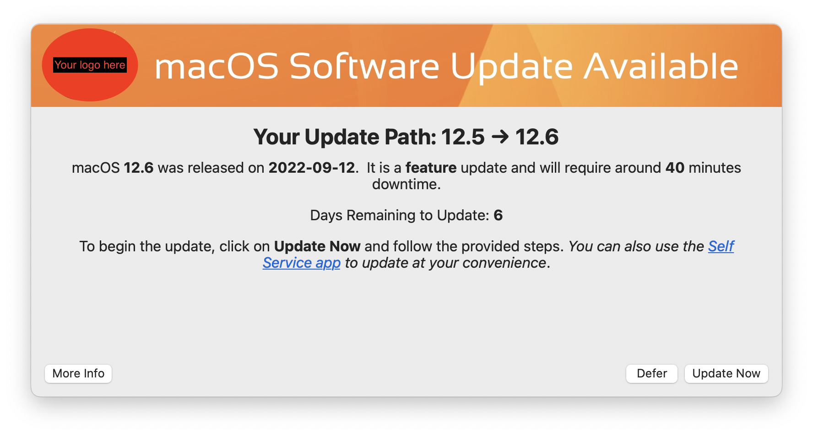

# macOS-Update-Notifier
Nudge like tool to prompt users to update. See https://github.com/macadmins/nudge for the inspiration

# Arguments
Arguments must follow the following format:
1. REQUIRED: major OS such as 11, 12, or 13. This should be the OS you want to enforce updates for. If you want everyone on the latest version of 12 specify that and it will only look for updates to 12. 
2. REQUIRED: Major OS update deadline. This will be used if it is detected that a major update is required. For example if you specify 13 in paremeter one you can specify the date everyone needs to be on 13 by. This will not effect non-major updates. 
3. OPTIONAL: Set this to "debug" for testing purposes
4. OPTIONAL: The OS you wish to imitate for testing purposes. Parameter 3 must be set

# Workflow
- Pulls down data from Apple website about latest version of macOS
- Compares whether current computer is on latest version
- If not is uses the softwareupdate binary to double check there is actually an update available
- If not it will run the jumpstart command
- If it passes checks it will display a dialog using Swift Dialog - https://github.com/bartreardon/swiftDialog 

# Features
- Displays date update was released from Apple so uses know how far behind they are 
- Grace period of 7 days after release to ensure people have a chance to update on their own
- Displays if it is a major or minor update and (very roughly) estimates how long it will take
- Coming Soon - Grace period after initial deployment 

